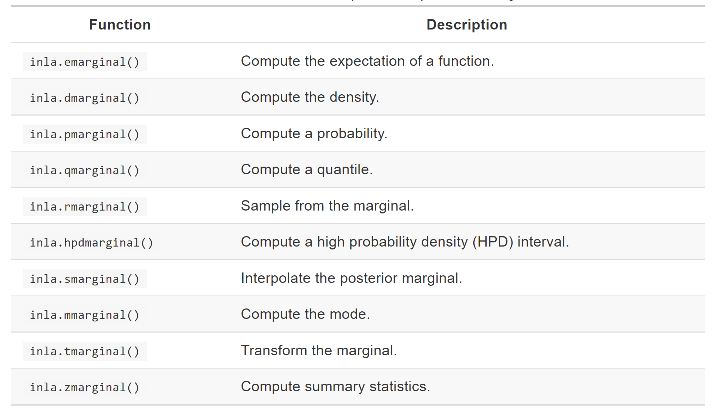

\pagenumbering{gobble} 
\pagenumbering{arabic} 

```{r setup, include=FALSE}
knitr::opts_chunk$set(echo = TRUE, message=FALSE, warning=FALSE, fig.align = "center", class.source='klippy')
```
```{r klippy, echo=FALSE, include=TRUE}
klippy::klippy(position = c('top', 'right'),color = 'darkred',
               tooltip_message = 'Click to copy', tooltip_success = 'Done')
```

In this practical we will use simulated data to get familiar with the basic `R-INLA` functions. First, we will familiarize with the manipulation of the posterior marginal distributions exploiting these for inference. `R-INLA` provides a number of functions to make computations on the posterior marginals. These are summarized in the book "Bayesian inference with INLA" that is freely available at the link https://becarioprecario.bitbucket.io/inla-gitbook/index.html (see section 2.6; a summary table is reported also below). 
Then, we will learn how to change the prior distributions.


Summary of functions to manipulate marginal distribution in the `INLA` package
```{r eval=TRUE, echo=FALSE}

```


# 1. Data simulation
The data are simulated from the following model
\[
y_i \sim \text{Normal}(\eta_i, \sigma=0.1) \qquad i=1,\ldots,n=100
\]
with
\[
\eta_i = \beta_0+ \beta_1 x_i
\]
where $\beta_0=2$, $\beta_1=0.5$ and the values of the covariate $\boldsymbol{x}$ are generated from an Uniform(0,1) distribution. The simulated response and covariate data are then saved in a `data.frame` object.


* To simulate the data, we can use the following code:
```{r eval = TRUE}
set.seed(1234) #set the seed
n = 100
sigma = 0.1
beta.0 =  2
beta.1 = 0.5
x = runif(n)
eta = beta.0 +  beta.1*x
y = rnorm(n,eta,sigma)
#plot(x,y) #plot the data
my.data = data.frame(y=y,x=x)
```


# 2. Model estimation and output exploration
We use `R-INLA` to estimate the parameters of the given model, where $\boldsymbol \theta=\{\beta_0,\beta_1\}$ and  $\boldsymbol\psi=\{1/\sigma^2\}$. In particular:

1. we load the `R-INLA` library and define the `formula`, which  includes only fixed effects.

(remember to install it if you have not done it before using `install.packages("INLA", repos="http://www.math.ntnu.no/inla/R/stable")`)

```{r eval=TRUE}
library(INLA)
formula = y ~ 1 + x
```

2. we call the `inla` function for estimation

```{r eval=TRUE}
output = inla(formula, family="gaussian", data=my.data)
```

3. we explore the output using the standard \texttt{summary} and \texttt{plot} options applied to the \texttt{inla} object named \texttt{output}:

```{r eval=TRUE}
#plot(output)
summary(output)
```


4. If we are interested in extracting the marginal posterior distribution of $\beta_0$ and $\beta_1$ 
we use the following code:

```{r eval=TRUE}
names(output$marginals.fixed) #check the fixed effect names
class(output$marginals.fixed) #NOTE: it is a list
post.beta0 = output$marginals.fixed[[1]]
post.beta1 = output$marginals.fixed$x
```

The plot of the marginal posterior distribution can be obtained using the `inla.smarginal` function as shown below; moreover, we include in the plot a polygon representing the 95% highest posterior density (hpd) interval:

```{r fig:marginals}
### beta1
plot(inla.smarginal(post.beta1),type="l",xlab="",ylab="",
     main=expression(paste("Post. marg. of ", beta[1])))
hpd.beta1 = inla.hpdmarginal(p=0.95,post.beta1)

# Prepare everything for the hpd polygon
xvalues = seq(hpd.beta1[1], hpd.beta1[2], length.out = 256)
yvalues = inla.dmarginal(xvalues,post.beta1)
xvalues = c(hpd.beta1[1],xvalues,hpd.beta1[2])
yvalues = c(0,yvalues,0)

polygon(xvalues, yvalues, col = "slateblue1", border = 1)

### Intercept
plot(inla.smarginal(post.beta0),type="l",xlab="",ylab="",
     main=expression(paste("Post. marg. of ", beta[0])))
hpd.beta0 = inla.hpdmarginal(p=0.95,post.beta0)

# Prepare everything for the hpd polygon
xvalues = seq(hpd.beta0[1], hpd.beta0[2], length.out = 256)
yvalues = inla.dmarginal(xvalues,post.beta0)
xvalues = c(hpd.beta0[1],xvalues,hpd.beta0[2])
yvalues = c(0,yvalues,0)

polygon(xvalues, yvalues,
         col = "slateblue1", border = 1)
```

5. Now we want to plot the marginal posterior distribution of the measurement error standard deviation $\sigma$ starting from the marginal posterior distribution of the precision for the Gaussian observations. The transformation is done through the `inla.tmarginal` function as follows:

```{r eval=TRUE}
names(output$marginals.hyperpar) #check the hyperparameter name
post.sigma = inla.tmarginal(function(x) sqrt(1/x), 
  		output$marginals.hyperpar[[1]]) 
# We use [[1]] instead of the long name

plot(inla.smarginal(post.sigma),type="l",xlab="",
ylab="",main=expression(paste("Post. marg. of ", sigma)))
hpd.sigma = inla.hpdmarginal(p=0.95,post.sigma)

# Prepare everything for the hpd polygon
xvalues = seq(hpd.sigma[1], hpd.sigma[2], length.out = 256)
yvalues = inla.dmarginal(xvalues,post.sigma)
xvalues = c(hpd.sigma[1],xvalues,hpd.sigma[2])
yvalues = c(0,yvalues,0)

polygon(xvalues, yvalues, col = "slateblue1", border = 1)
```

Finally we can obtain some summary statistics about the distribution using the `inla.zmarginal` function:
```{R eval=TRUE}
inla.zmarginal(post.sigma)
```

# 3. Change the priors 

## 3.1 Fixed effects
The default prior adopted by `R-INLA` for the regression parameters $\beta_0$ and $\beta_1$ are vague distributions. In details,
the intercept of the model is assigned a Gaussian prior with mean and precision equal to 0. The rest of the fixed effects are assigned Gaussian priors with mean equal to 0 and precision equal to 0.001. The option `control.fixed` of the `inla` function can be used for changing these priors. For example if we want to specify $\beta_0\sim\text{Normal}(0,10^4)$ and $\beta_1\sim\text{Normal}(0,1)$ we will use the following code:

```{r eval=TRUE}
output2 = inla(formula, family="gaussian", data=my.data,
               control.fixed=list(mean=0,prec=1,
                                  mean.intercept=0,prec.intercept=0.0001))
```


where `mean` and `prec` represent the mean and precision of the regression parameters (excluding the intercept, whose parameters can be accessed through `mean.intercept` and `prec.intercept`)\footnote{Note that when the model includes more than one fixed effect, a `list` has to be specified. For example `control.fixed=list(mean=list(a=1, b=2, default=0))` assigns prior mean equal to 1 for fixed effect `a` and equal to 2 for `b`; all the other fixed effects has a zero prior mean. The same holds for the precision `prec`.}.

The new marginal posteriors for $\beta_0$ and $\beta_1$ are compared with the old ones computed before:

```{r, eval=TRUE}
plot(inla.smarginal(post.beta0),type="l",xlab="",ylab="",
     main=expression(paste("Post. marg. of ", beta[0])))
lines(inla.smarginal(output2$marginals.fixed[[1]]),col=2)
abline(v=beta.0)
legend("topleft",col=c(1,2),lty=c(1,1),
       legend=c("Default","Normal(0,0.0001)"),box.lty=0)

plot(inla.smarginal(post.beta1),type="l",xlab="",ylab="",
     main=expression(paste("Post. marg. of ", beta[1])))
lines(inla.smarginal(output2$marginals.fixed$x),col=2)
abline(v=beta.1)
legend("topleft",col=c(1,2),lty=c(1,1),
       legend=c("Default","Normal(0,1)"),box.lty=0)
```

We do not detect any difference in the posterior distributions.

## 3.2 Outcome precision $(1/\sigma^2)$

The default prior adopted by `R-INLA` for the response precision $\tau=1/\sigma^2$ is a noninformative logGamma prior defined on the logarithm of the precision (internal scale). The default prior distribution is 
\[
\log(\tau)=\log(1/\sigma^2)\sim \text{logGamma}(1,5e-05)
\]
This is equivalent to assume a Gamma prior on the precision, i.e. $\tau\sim \text{Gamma}(1, 0.00005)$ (see Section 5.1 and 5.1.2 of the INLA book 'Spatial and Spatio-Temporal Bayesian Models with R-INLA').  
It is possible to change this prior using the `control.family` option of the `inla` function. For example if we want to specify a standard Normal(0,1) prior on the logarithm of the precision we will type:

```{r eval=TRUE}
output3 = inla(formula, family="gaussian", data=my.data,
               control.family=list(hyper=list(
                                    prec=list(prior="gaussian",param=c(0,1))))
               )
```

Instead if we want to assume for $\tau$ a Gamma-prior with parameters (1, 0.01) we will type:
```{r eval=TRUE}
output4 = inla(formula, family="gaussian", data=my.data,
               control.family=list(hyper=list(
                                  prec=list(prior="loggamma",param=c(1,0.01))))
               )
```

The default and two alternative posterior distributions are compared below:

```{r eval=TRUE}
post.sigma3 = inla.tmarginal(function(x) sqrt(1/x), 
    	output3$marginals.hyperpar[[1]]) 
post.sigma4 = inla.tmarginal(function(x) sqrt(1/x), 
      output4$marginals.hyperpar[[1]]) 

plot(inla.smarginal(post.sigma),type="l",xlab="",
ylab="",main=expression(paste("Post. marg. of ", sigma)))
lines(inla.smarginal(post.sigma3),col=2)
lines(inla.smarginal(post.sigma4),col=3)
abline(v=sigma)
legend("topright",col=c(1,2,3),lty=c(1,1,1),
       legend=c("Default","Normal(0,1)","logGamma(1,0.01)"),box.lty=0)
```