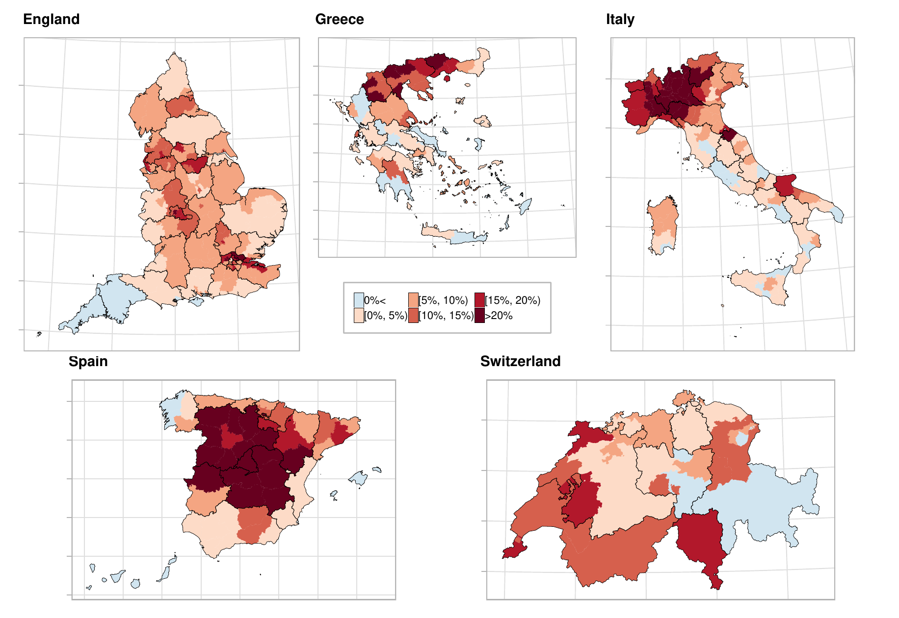
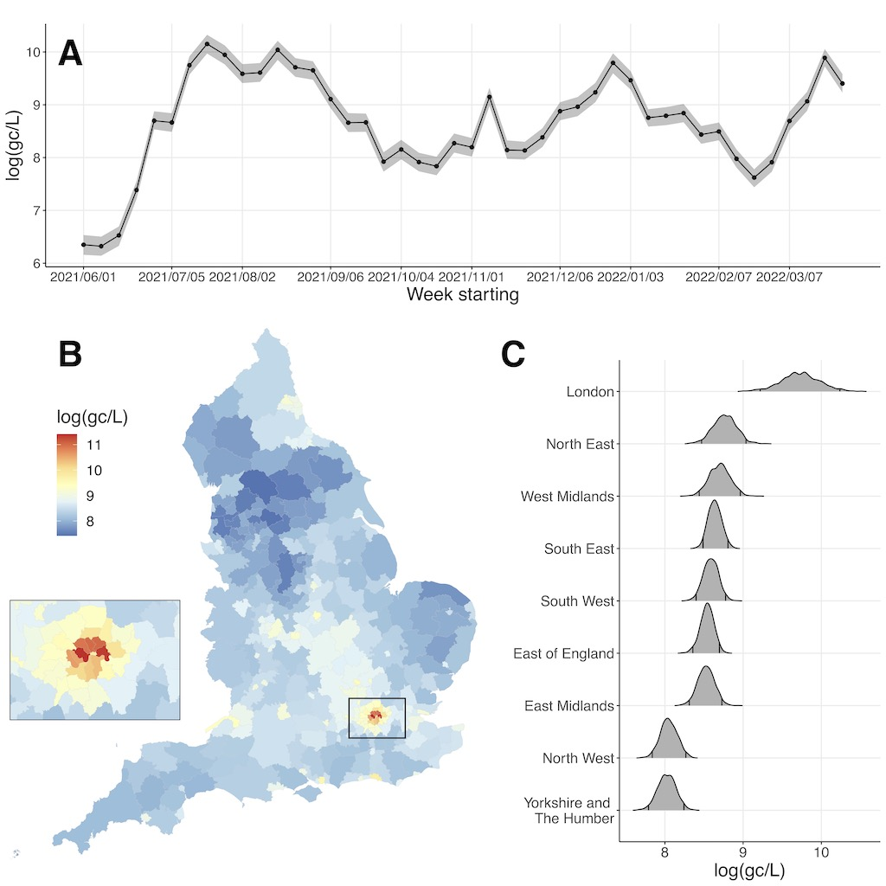
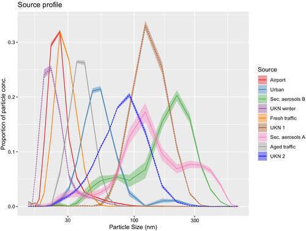
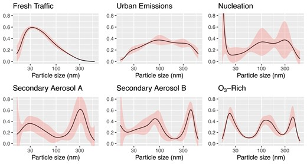
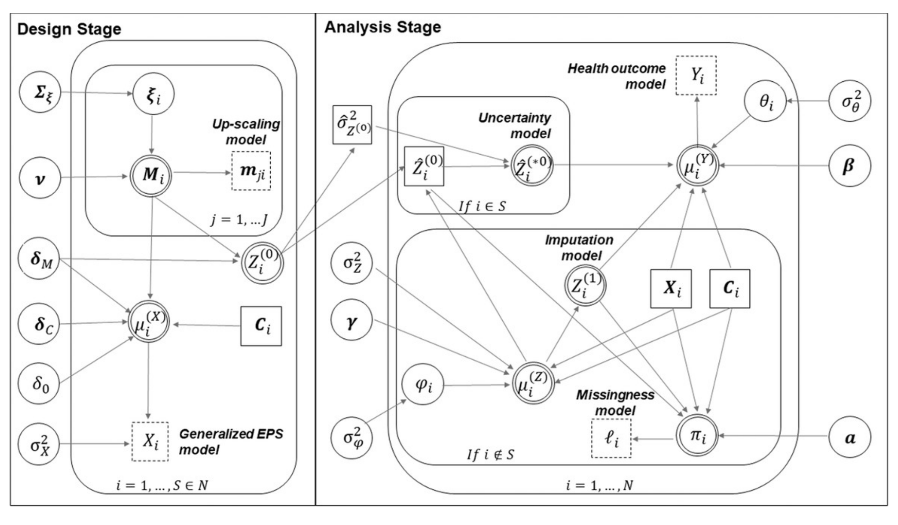
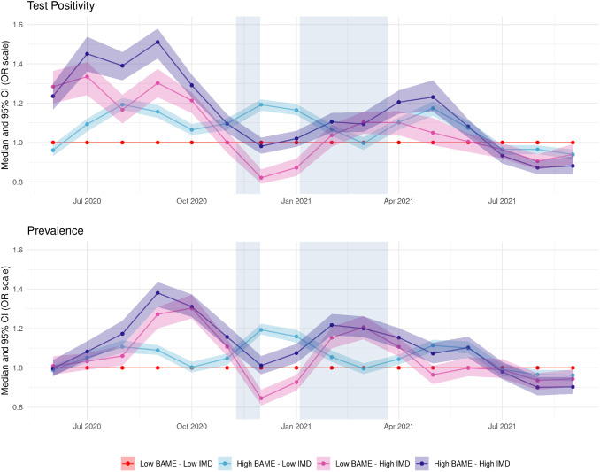
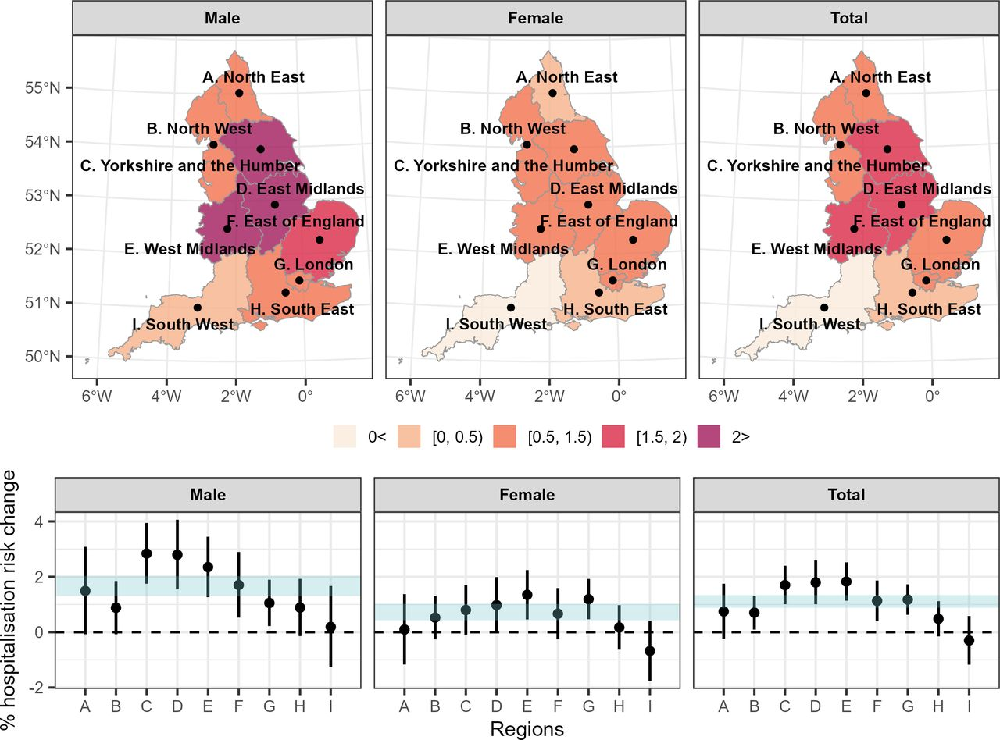
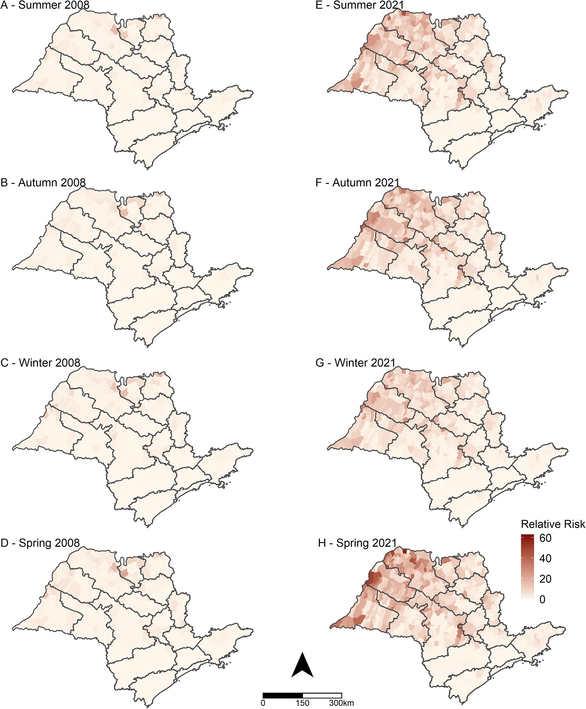
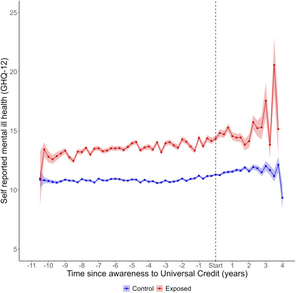
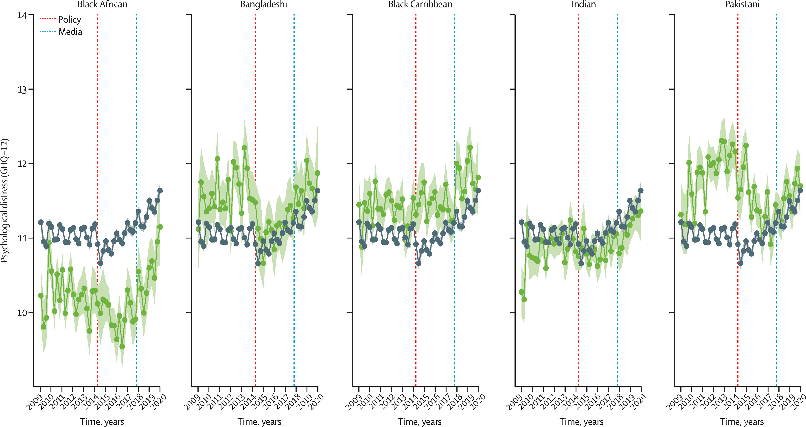

My research aims at developing statistical methodology and innovative data analytics, anchored in the Bayesian hierarchical modelling paradigm and machine learning, to improve statistical inference in environment and health studies. I lead the [environmental and health statistics group](http://www.envstats.org) at Imperial College. The main projects I work on are described below.

## Epidemiological Surveillance

**I have been developing and applying spatio-temporal disease mapping and surveillance models for chronic disease epidemiology, focusing on the detection of areas characterised by unusual trends.**

:::::: columns
::: {.column width="50%"}
For instance, during the COVID-19 pandemic I worked on hierarchical spatio-temporal models for estimating excess mortality and hospital admissions [@konstantinoudis2022regional; @blangiardo2020estimating]

As part of the project we built a dashboard to disseminate the results, available [here](http://atlasmortalidad.uclm.es/italyexcess/)
:::

::: {.column width="10%"}
<!-- empty column to create gap -->
:::

::: {.column width="40%"}
{width="500"}
:::
::::::

## Spatio-temporal models

**My research employs flexible, spatio-temporal semi- and nonparametric models for large complex data from environmental and epidemiological studies.**

:::::: columns
::: {.column width="50%"}
-   Recently I have started exploring how wastewater-based epidemiology can be used to predict disease processes which are changing in space and time. We specified a geostatistical model using the network of sites across England and predicted the value at Lower Tier Local Authority level.

- We also had a webapp to disseminate the results of this project available [here](https://b-rowlingson.gitlab.io/wwatlas/)
:::

::: {.column width="10%"}
<!-- empty column to create gap -->
:::

::: {.column width="40%"}
{width="400"}
:::
::::::

-   I am working on Bayesian non-parametric models and functional data analysis to estimate the air pollution sources from compositional data or particle sizes for particulate matter and linking these to health data.

:::::: columns
::: {.column width="50%"}

{width="400"}
:::

::: {.column width="10%"}
<!-- empty column to create gap -->
:::

::: {.column width="40%"}
{width="400"}
:::
::::::

-   I have also developed a framework to integrate individual and aggregated data from multiple sources to better provide confounder adjustment at the area level for environmental epidemiology studies [@wang2019using; @pirani2020flexible]

{width="450"}

## RSS-Turing Data Lab

The work of the Turing-RSS Lab I have been involved with has focused on (i) spatio-temporal modelling of health inequalities during the COVID pandemic [@padellini2022time], (ii) data integration to de-bias prevalence data [@nicholson2022improving]and on (iii) an interoperable concept which proposes a modular way to approach modelling [@nicholson2022interoperability]

{width="300"}

## Climate Change

I have been involved in several projects related to climate change; in particular

:::::: columns
::: {.column width="50%"}
-   to evaluate the effect of hot temperature on respiratory diseases, using case-crossover designs couple with spatially varying coefficients [@konstantinoudis2022ambient; @konstantinoudis2023asthma]
:::

::: {.column width="10%"}
<!-- empty column to create gap -->
:::

::: {.column width="40%"}
{width="400"}
:::
::::::

:::::: columns
::: {.column width="50%"}
-   to assess the impact of changing environmental factors on scorpionism using disease mapping and ecological regression models [@chiaravalloti2023] 
:::

::: {.column width="10%"}
<!-- empty column to create gap -->
:::

::: {.column width="40%"}
{width="250"}
:::
:::::

 
## Natural experiments for policy evaluation

This research programme aims to provide a methodological framework to draw causal inference for longitudinal data, accounting for their hierarchical nature, the existence of time series components and the use of negative outcome controls. We account for the hierarchical nature of the data (in space, such as for electoral wards and/or across organisational units such as schools/universities), which is a key characteristic in many social and epidemiological applications. The flexibility of the approach allow to incorporate trends deviating from linearity (for instance polynomial or splines) and, in line with existing literature, use variable selection techniques such as spike-and-slabs to build a parsimonious regression model for the outcome [@Gascoigne2024;@Jeffery2024].

:::::: columns
::: {.column width="50%"}
{width="300"}
:::

::: {.column width="10%"}
<!-- empty column to create gap -->
:::

::: {.column width="40%"}
{width="400"}
:::
::::::

