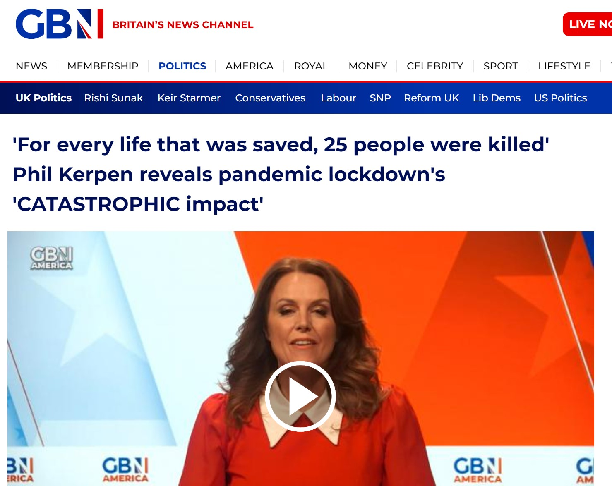

```{r global_options, echo = FALSE, include = FALSE}
options(width = 999)
knitr::opts_chunk$set(echo = FALSE, warning = FALSE, message = FALSE,
                      cache = FALSE, tidy = FALSE, size = "small")
```
```{r echo=F,message=FALSE,warning=FALSE,comment=NA}
# Sources the R file with all the relevant setup and commands
source("assets/setup.R")

# Stuff from 'xaringanExtra' (https://pkg.garrickadenbuie.com/xaringanExtra)
# This allows the use of panels (from 'xaringanExtra')
xaringanExtra::use_panelset()
# This allows to copy code from the slides directly
#xaringanExtra::use_clipboard()
# This freezes the frame for when there's a gif included
#xaringanExtra::use_freezeframe()

# Defines the path to the file with the .bib entries (in case there are references)
#bibfile=RefManageR::ReadBib("C:/users/magb/Dropbox/Conferences-Talks/GEOMED/GEOMED2024/refs.bib",check = FALSE)
```
class: title-slide

# `r rmarkdown::metadata$title``r vspace("10px")` `r rmarkdown::metadata$subtitle`

## `r rmarkdown::metadata$author`

### `r rmarkdown::metadata$institute`    

### `r rmarkdown::metadata$params$conference`, `r rmarkdown::metadata$params$location` 

<!-- Can also separate the various components of the extra argument 'params', eg as in 
### `r paste(rmarkdown::metadata$params, collapse=", ")`
-->

`r ifelse(is.null(rmarkdown::metadata$params$date),format(Sys.Date(),"%e %B %Y"),rmarkdown::metadata$params$date)`

`r vspace("20px")`

`r include_fig("MRC-Centre-Logo.png", width="30%")`

---

layout: true  

.my-footer[ 
.alignleft[ 
&nbsp; &copy; Marta Blangiardo 
]
.aligncenter[
`r rmarkdown::metadata$params$short_title` 
]
.alignright[
`r rmarkdown::metadata$params$conference`, `r short_date` 
]
] 

```{css,echo=FALSE, eval=FALSE}
.red {
  color: red;
}
.blue {
  color: 0.14 0.34 0.55;
}

.content-box-blue { background-color: #F0F8FF; }

}
```
<style>
pre {
  overflow-x: auto;
}
pre code {
  word-wrap: normal;
  white-space: pre;
}
</style>


---

#Policies are everywhere

<style>
.image-1 {
  position: absolute;
  top: 10%;
  left: 20%;
}
</style>
 
.image-1[  ]

---

count:false

#Policies are everywhere

<style>
.image-2 {
  position: absolute;
  top: 20%;
  left: 60%;
}
</style>

.image-1[  ]

.image-2[  ]

---

count:false

#Policies are everywhere

<style>
.image-3 {
  position: absolute;
  top: 30%;
  left: 10%;
}
</style>

.image-1[  ]

.image-2[  ]

.image-3[  ]

---

count:false

#Policies are everywhere

<style>
.image-4 {
  position: absolute;
  top: 40%;
  left: 50%;
}
</style>

.image-1[  ]

.image-2[  ]

.image-3[  ]

.image-4[  ]

---

count:false

#Policies are everywhere

<style>
.image-5 {
  position: absolute;
  top: 55%;
  left: 23%;
}
</style>

.image-1[  ]

.image-2[  ]

.image-3[  ]

.image-4[  ]

.image-5[  ]

---

# More policies = less evidence?

<style>
.image-6 {
  position: absolute;
  top: 20%;
  left: 10%;
}

.image-7 {
  position: absolute;
  top: 20%;
  left: 30%;
}

.image-8 {
  position: absolute;
  top: 20%;
  left: 40%;
}

</style>
  
.center[Evaluating the effects of policy interventions is of crucial importance]

--

.image-6[  ]

--

.image-7[  ]

--

.image-8[  ]

--

`r vspace("500px")`
.center[.red[Robust statistical methods needed]]

---
# Can we infer causality?

- Randomised clinical trials are not viable

--

`r vspace("20px")`

.content-box-green[**Quasi-experimental designs**

Research design used to estimate the causal impact of an intervention on its target population without random assignment.]

--

`r vspace("50px")`


- How to deal with possible dependencies (presence of pre- and post-intervention trends, similarity across space/units)?

`r vspace("20px")`

- Find comparable control groups to deal with residual confounding.

---

# Outline

`r vspace("20px")`

- Quasi-experimental design in a longitudinal setting.

`r vspace("20px")`

- Adding dependency: hierarchical models as a general framework.

`r vspace("40px")`

--

- Examples: incinerators and infant health

`r vspace("20px")`

- Examples: welfare policies in the UK and mental health

`r vspace("40px")`

--

`r vspace("20px")`

- Future directions: Spillover

---

# Longitudinal setting: ITS

.content-box-green[**Interrupted Time Series (ITS)**
                     
A time series of a particular outcome of interest is "interrupted" by an intervention at a known point in time.
                   
Particularly useful for "natural experiments" in real world settings.
]

.pull-left[
`r include_fig("ITS.jpg", width="80%")`
  
.small[Kontopantelis et al., BMJ 2015; 350: h2750]
]

.pull-right[
In its general formulation:
    
- Linear effect of intervention.
`r vspace("10px")`
- Do not account for external time varying effects or autocorrelation.
`r vspace("10px")`
- Do not include controls.
`r vspace("10px")`
- Causal effects: step and slope change.
]

---
  
# Difference in difference

<!--
https://www.publichealth.columbia.edu/research/population-health-methods/difference-difference-estimation

-->

If controls are available the difference-in-difference approach (DID) is a popular choice:
  
.pull-left[
`r include_fig("d-i-d.png", width="60%")`
    
.small[D. Polsky, M. Baiocchi, in Encyclopedia of Health Economics, 2014]
]

.pull-right[
`r vspace("10px")`
- Do not account for external time varying effects or autocorrelation
`r vspace("10px")`
- Before-after approach
`r vspace("10px")`
- Causal effects: step change
]


`r vspace("20px")` 

Other methods under this umbrella: segmented regression, regression discontinuity...

---
  
# A general framework
  
These methods have been developed to perform causal inference on longitudinal data dealing with specific data availability

- They are similar! 
  
  
.content-box-green[**AIM**
                       
- Build a general framework for quasi-experimental designs in a longitudinal setting
                     
- Deal with a common limitation: lack of additional dependence (e.g. in space) & generally simplified assumptions on trends (computational reasons / to make life easy)
                     
$\Rightarrow$ Bayesian Hierarchical Modelling Framework
]

---
  
# Can we re-frame this?
  
.panelset[
.panel[.panel-name[Bayesian Hierarchical Framework]
           
For each unit $i=1,\ldots,I$ (areas or individuals) and time $t=1,\ldots, T\geq \text{2}$, the data comprise: 
             
`r vspace("10px")`
           
- the outcome $y_{it}$; 
`r vspace("10px")`
           
- a vector of $K$ covariates (confounders) $\bm{X}_{it}=(X_{it1},\ldots,X_{itK})$; 
           
`r vspace("10px")`
           
- an indicator variable $z_{t}=1$ if the intervention is being applied at time $t$ and 0 otherwise; 
           
`r vspace("10px")`
           
- an indicator variable $w_{i}=1$ if unit $i$ is exposed and 0 if it is a control.
           
`r vspace("20px")`
           
The generalised linear predictor for the average of the outcome $\mu_{it}$:
             
$$E[y_{it}] = h(\mu_{it}) = \alpha_0 + \alpha_1 w_i + \delta_0 z_{t} + \delta_1 w_i z_t+ \sum_{k=1}^K \beta_k X_{itk} + \gamma_i + \boldsymbol{\lambda}_t$$
]
    
.panel[.panel-name[Why hierarchical]
           
- Flexible structure - adapt to data availability:
             
$\Rightarrow$ Can include controls and non linearity in time trends.
           
- Account for dependencies in space / across units: 
             
$\Rightarrow$ $\bm{\gamma}$ can be modelled as exchangeable or spatially structured (neighborhood or distance based); 
           
- $\delta_1$ $(\delta_0)$ identifies the causal effect of the intervention. Additional time dependent causal effects can be obtained through $\lambda_t$ if appropriate.
           
$$E[y_{it}] = h(\mu_{it}) = \alpha_0 + \alpha_1 w_i + \delta_0 z_{t} + \delta_1 w_i z_t+ \sum_{k=1}^K \beta_k X_{itk} + \gamma_i + \boldsymbol{\lambda}_t$$
]
    
.panel[.panel-name[Why Bayesian]
           
- Can include relatively vague information in the priors, which can still help regularise the inference
           
$\rightarrow$ Avoid inconsistent estimates because of small numbers/separation
           
$\rightarrow$ Use Penalised Complexity (PC) priors

`r vspace("20px")`

- Direct characterisation of full uncertainty in all model parameters
           
$\rightarrow$ Can then rescale (e.g. from regression coefficients to original scores etc) and still obtain samples from the full posterior distributions
           
$\rightarrow$ Particularly helpful for generalised linear models and for obtaining functions of original parameters
           
$\rightarrow$ Can aggregate at any space-time resolution
           
]
]
---

# Example: incinerators effects on health
  
- Recent increase in incineration of municipal waste in response to European Union (EU) legislation to divert waste from landfills.
`r vspace("20px")`

- Few studies available, despite public concern about potential for adverse effects from this and other waste management processes on birth and other health outcomes.

<!-- - EU Waste Incinerator Directive aims  at reducing and preventing negative effects on the environment produced from incineration. --> 
  
--
  
.pull-left[
`r include_fig("NOincinerator.png", width="65%")`
]

.pull-right[
`r include_fig("Incinerators_reuters.png",width="85%")`
]

---
  
# The project
  
`r include_fig("Project_inc.png")`

---
  
# Data
  
.pull-left[
- Eight Municipal Waste Incinerators (MWIs) opening within 2003-10; study period  1998-2012.
`r vspace("20px")`
- Exposed areas as middle super output areas whose centroids lay within a 10km radius buffer of each of the eight MWIs.
`r vspace("20px")`
- Matched 10km buffers as controls,  based on  live births, mean percentage of low social class, lack of car ownership, overcrowding,  male unemployment, population density and non-white percentage ethnicity. 
    
`r include_fig("Controls_inc.png")`
    
]

.pull-right[
`r vspace("50px")`
  
`r include_fig("incloc1.png")`
]

---
  
#The model 
  
$y_{itj} \sim Bin(\mu_{itj},n_{itj} )$ for  infant mortality;

$y_{itj} \sim \mathcal{N}(\mu_{itj}, \sigma^2)$ for sex ratio.  


On the linear predictor

$$h(\mu_{itj}) = {\color{red}{\alpha_0 + \alpha_1 w_{i}}} +
  \psi_0 t + \psi_1 w_{i} t  + \delta_0 z_{tj_i}(t-t_{0j_i}) + \delta_1 w_{i} z_{tj_i}(t-t_{0j_i}) + \sum_{k=1}^K \beta_k X_{ik} + \gamma_i$$
  
`r vspace("30px")`

.pull-left[
`r include_fig("InfMort.png",width="75%")`
]

<!-- CG: above uses lambda*t and psi*t whereas below there is lambda_t and psi_t. Are these parameters (i.e., betas) of linear trend in time or a function of time? -->
  
<!-- CG: t_0 is the start of the intervention? or the start of time? Figure its the former -->
  
.pull-right[
- Linear trends on time
- On $\gamma_i$  we assume a combination of spatial and unstructured random effects

]

---

count:false

#The model 
  
$y_{itj} \sim Bin(\mu_{itj},n_{itj} )$ for  infant mortality;

$y_{itj} \sim \mathcal{N}(\mu_{itj}, \sigma^2)$ for sex ratio.  


On the linear predictor

$$h(\mu_{itj}) = \alpha_0 + \alpha_1 w_{i} +
  {\color{red}{\psi_0 t + \psi_1 w_i t}}  + \delta_0 z_{tj_i}(t-t_{0j_i}) + \delta_1 w_i z_{tj_i}(t-t_{0j_i}) + \sum_{k=1}^K \beta_k X_{ik} + \gamma_i$$
  
`r vspace("30px")`

.pull-left[
`r include_fig("InfMort.png",width="75%")`
]

<!-- CG: above uses lambda*t and psi*t whereas below there is lambda_t and psi_t. Are these parameters (i.e., betas) of linear trend in time or a function of time? -->
  
<!-- CG: t_0 is the start of the intervention? or the start of time? Figure its the former -->
  
.pull-right[
- Linear trends on time
- On $\gamma_i$  we assume a combination of spatial and unstructured random effects

]

<!-- 5 years before and after the policy -->

<!-- Excess in females in exposure areas reported before, but not here -->

---

count:false

#The model 
  
$y_{itj} \sim Bin(\mu_{itj},n_{itj} )$ for  infant mortality;

$y_{itj} \sim \mathcal{N}(\mu_{itj}, \sigma^2)$ for sex ratio.  


On the linear predictor

$$h(\mu_{itj}) = \alpha_0 + \alpha_1 w_{i} +
 \psi_0 t + \psi_1 w_i t  +  {\color{red}{\delta_0 z_{tj_i}(t-t_{0j_i}) + \delta_1 w_i z_{tj_i}(t-t_{0j_i})}} + \sum_{k=1}^K \beta_k X_{ik} + \gamma_i$$
  
`r vspace("30px")`

.pull-left[
`r include_fig("InfMort.png",width="75%")`
]

<!-- CG: above uses lambda*t and psi*t whereas below there is lambda_t and psi_t. Are these parameters (i.e., betas) of linear trend in time or a function of time? -->
  
<!-- CG: t_0 is the start of the intervention? or the start of time? Figure its the former -->
  
.pull-right[
- Linear trends on time
- On $\gamma_i$  we assume a combination of spatial and unstructured random effects

]

---

# Interpretation
  
`r vspace("50px")`

`r include_fig("Effects_inc.png")`

- $\delta_0$: potential discontinuity in controls before-after intervention.

`r vspace("20px")`

- $\delta_1$: difference of differences before - after intervention between exposed and controls (at intervention time).

--
  
`r vspace("50px")`

- Rich output means that we can easily look at differences for specific times before-after.

`r vspace("20px")`

- Potential flexibility of the model traded-off with the difficulty in interpretation if a more flexible time trend is considered.


---
  
# Results
  
`r include_fig("Incinerator_results.jpg")`

- No evidence of an effect on infant mortality and sex ratio
---
  
# Example: Welfare policies and mental health
  
.pull-left[
`r vspace("50px")`

- As a modern welfare state, one of the core functions of Government is to promote equitable social and economic wellbeing for its citizens. 
    
`r vspace("10px")`
    
- Broad set of policy levers, ranging from taxation, welfare reform, migration policy to the provision of public health care
    
`r vspace("10px")`
    
- Ineffective implementation of policy may result in negative consequences for population mental health, especially when intentionally or unintentionally generates or perpetuates social and economic inequities in society
    
]

.pull-right[
`r include_fig("EPITOME.png", width="200%")`
]

---


# Universal credit

.pull-left[
- UC was introduced in the UK in the early 2010s by the coalition government led by the Conservatives

`r vspace("10px")`

- Theoretical aim was to simplify and facilitate access and receipt of welfare according to need. 

`r vspace("10px")`

- In practice lengthy delay in payment and increased sanction with individuals receiving reduced amounts or no amount of welfare support at all for long periods
]

.pull-right[
`r include_fig("UC_MH.png", width="80%")`

`r include_fig("TrussellTrust.jpg", width="40%")`
]

---


#Data & Model

- [UK Household Longitudinal Survey](https://www.understandingsociety.ac.uk/) ("*Understanding Society*")

`r vspace("10px")`

- Age 16-64 with 
  - (i) employment status, 
  - (ii) Lower Layer Super Output Area (LSOA) of residence, 
  - (iii) responded at least once to mental health questionnaire - score from 0 - 36 derived from the GHQ-12 questionnarie where higher scores indicating more severe impairment

- Period: 2009-2020

`r vspace("10px")`

.pull-left[
- **Exposure variable** was defined as unemployment status

`r vspace("10px")`

- **Policy definition** contextual awareness using monthly statistics (Department of Work and Pensions) of UC - when it reaches 25% we assume the Local Authority has switched to UC. 
`r vspace("10px")`

- **Confounders**  (individuals) age, education level, ethnicity, relationship status, and sex; (area level) social deprivation and ethnic diversity  
]

.pull-right[
`r vspace("-20px")`
\begin{align*}
E(Y_{it})=h(\mu_{it}) & \alpha_{0} + \alpha_{1} w_{it} +\\
& \psi_{0} {t} +  \psi_{1} {t} w_{it}  +\\
&{\color{red}{\delta_{0}^{\star} z_{it} + \delta_{1}^{\star} z_{it} w_{it}}}  + \\
&\delta_{0} z_{it}(t - {t_{0i}}) + \delta_{1} z_{it} (t - {t_{0i}}) w_{it} +\\
& \sum_{k=1}^K \beta_k X_{itk} + 
\lambda_t + \boldsymbol{\gamma}_i 
\end{align*}

- $\boldsymbol{\gamma}_i$ includes individual, spatial random effect and strata/clusters coming from the survey design

- Immediate and sustained effects estimated  

]

---

# Results: fixed effects

`r include_fig("Fixed_effects.png")`

---

# Standardised change

.content-box-green[**Standardised change**

It estimates the change in the score in the exposed population before and after the intervention, while adjusting for what happens in the controls during the same period.
]

- E=exposed; 
- C=non exposed; 
- A= time points after the introduction of the policy; 
- B=time points before the introduction of the policy 

1. $p^\text{EA} = \mu^{^\text{EA}}$
posterior distribution of the average linear predictor for all exposed individuals after the intervention only

2. $\tilde{p}^\text{EB} = \mu^\text{EB} \frac{\mu^\text{CA}}{\mu^\text{CB}}$
posterior distribution of the average linear predictor for all exposed individuals before the intervention only 
$\rightarrow$ rescaling using the controls

3. $\rho = ({p^\text{EA} - \tilde{p}^\text{EB}}) / {\tilde{p}^\text{EB}}$

is a **standarsised change of the impact of UC on mental distress**

$\rightarrow$ Full posterior distribution

---

# Results: standardised change

`r include_fig("universal-credit.jpg", width="85%")`

---

  
# The Windrush generation
  
.pull-left[
`r include_fig("windrush.png")`
  ]

.pull-right[
- After the Second World War, the UK faced severe labour shortages. To make up for this they encouraged people from British Colonies to move to the UK, with the promise of jobs, a better standard of living, and British Citizenship 
    
- Between 1948 and 1970, nearly half a million people moved from the Caribbean to Britain. These individuals became known as the **Windrush Generation**, after the ship which carried some of the first migrants
    
- The Immigration Act of 1971 meant that only commonwealth citizens who arrived before 1971 were allowed the right to stay in the UK
    
- However, in 2010 the British Home Office destroyed all migration records from the 1950s and 1960s
  
- This meant that many people who came to Britain as part of the Windrush Generation, and many of their children, no longer had evidence of their British Citizenship
]

---
  
# Hostile environment and the Windrush scandal
  
.pull-left[
- The UK government (under pressure from nationalist/populist parties pushing for brexit), started a series of immigration reforms, collectively known as the *hostile environment policy*, in **2012** followed by the Immigration Act in **2014**
      

      
- These policies deliberately aimed to make life difficult for migrants and operated on a "deport first, ask questions later" basis
    

      
- In **2017** the "[Windrush scandal](https://en.wikipedia.org/wiki/Windrush_scandal)" hits the mainstream media headlines and cost her job to the new Home Secretary, Amber Rudd, but not to the one who actually enacted the policy...
    
]

.pull-right[
  
`r include_fig("media-coverage.png")`
]


---
  
# Data and timeline
  
We use data from The [UK Household Longitudinal Survey](https://www.understandingsociety.ac.uk/) ("*Understanding Society*")

### Participants
- Age 16+, responded at least once to mental health questionnaire

### Timing
- 12x 24 month “waves”, January 2009 to March 2020
- Avoid "Covid" confounding...

### Outcome & exposure
- Outcome: Mental ill health using the GHQ score

- Exposures: 
  - Immigration Act 2014
  - Windrush media coverage 2017
  - Exposed ethnicities: Black African, Black Caribbean, Indian, Pakistani, Bangladeshi vs White

- Main confounders:  age, sex, urban/rural, IMD, children, UK born, education, working condition

---
  
# Study design 

<!--Question: the  starred one is not the average effect rather than the immediate? -->

.pull-left[
`r vspace("20px")`
    
`r include_fig("timeline.png", width="150%")`
]

.pull-right[ 
`r vspace("20px")`
For individual $i$, ethnical group $j$, month $t$ 
`r vspace("20px")`
\begin{align*}
E(Y_{ijt})= h(\mu_{ijt}) &= \\
& \alpha_{0} + \alpha_{j} w_{j_i} + \\
&\psi_{0} t + \psi_{j} w_{j_i} t + \\
&{\color{red}{\phi_{0}^{\star} z_{t}^{1} + \phi_{j}^{\star} z_{t}^{1} w_{j_i}}} + \\
&{\color{red}{\phi_{0} z_{t}^{1} (t - t_{0}^{1})}} + {\color{red}{\phi_{j} z_{t}^{1} (t - t_{0}^{1}) w_{j_i}}} + \\
&{\color{red}{\delta_{0}^{\star} z_{t}^{2} + \delta_{j}^{\star} z_{t}^{2} w_{j_i}}} + \\
&{\color{red}{\delta_{0} z_{t}^{2} (t - t_{0}^{2})}} + {\color{red}{\delta_{j} z_{t}^{2} (t - t_{0}^{2}) w_{j_i}}} + \\
& \sum_{k=1}^K \beta_k X_{itk} + \gamma_i + \lambda_t
\end{align*}
]

.pull-left[
- More than one **policy**
- More than one **exposed groups**
]

.pull-right[
`r vspace("-100px")`

- $\phi_{0}^{\star}$, $\phi_{j}^{\star}$, $\delta_{0}^{\star}$ and $\delta_{j}^{\star}$ immediate effect of first and second policies for control and $j$ exposure groups
- $\phi_{0}$ and $\phi_{j}$, $\delta_{0}$ and $\delta_{j}$ sustained effect of first and second policies for control and $j$ exposure groups
]


---

# Results

```{r}
#| echo: false
#| label: various-effects
#| width: 8
#| height: 5
#| out-width: "65%"
t1=tibble(
  group=c(
    "Black African",
    "Black Caribbean",
    "Indian",
    "Pakistani",
    "Bangladeshi"
  ),
  t=c(
    .53,.67,.35,.27,-.43
  ),
  low=c(
    -.12,.06,-.2,-.33,-1.24
  ),
  upp=c(
    1.17,1.28,.89,.88,.38
  )
)
t2=tibble(
group=c(
    "Black African",
    "Black Caribbean",
    "Indian",
    "Pakistani",
    "Bangladeshi"
  ),
  t=c(
    -.32,-.12,-.19,-.53,-.2
  ),
  low=c(
    -.62,-.4,-.44,-.81,-.57
  ),
  upp=c(
    -.01,.17,.06,-.25,.17
  )
)
t3=tibble(
  group=c(
    "Black African",
    "Black Caribbean",
    "Indian",
    "Pakistani",
    "Bangladeshi"
  ),
  t=c(
    .54,1.28,.08,.52,-.66
  ),
  low=c(
    -.44,.34,-.69,-.32,-1.85
  ),
  upp=c(
    1.52,2.21,.85,1.37,.53
  )
)
t4=tibble(
  group=c(
    "Black African",
    "Black Caribbean",
    "Indian",
    "Pakistani",
    "Bangladeshi"
  ),
  t=c(
    .45,-.07,.28,.25,.19
  ),
  low=c(
    0,-.51,-.08,-.13,-.36
  ),
  upp=c(
    .91,.37,.63,.62,.73
  )
)

t1<- t1 |> mutate(label="Post Immigration Act 2014") |> 
  bind_rows(t2 |> mutate(label="Time since start of exposure period 2")) |> 
  bind_rows(t3 |> mutate(label="Post media coverage 2017")) |> 
  bind_rows(t4 |> mutate(label="Time since start of exposure period 3"))

 
plot1<-  ggplot(t1,aes(t,group,color=label)) + 
  geom_linerange(
    aes(xmin=low,xmax=upp),position=position_dodge(.3) 
  ) + 
  geom_point(position=position_dodge(.3)) + theme_bw() +
  geom_vline(xintercept = 0, linetype = "dashed") + 
  labs(x="Difference in the change in mean GHQ12 score",y="") +
  theme(legend.position="bottom",legend.title=element_blank())
```

```{r fig.height=4}
plot1
```
- evidence of greater psychological distress in people from Black Caribbean backgrounds

- increase in mental distress between the two periods with post media coverage having a bigger effect across all ethnic groups


<!-- we found evidence of greater psychological distress in people from Black Caribbean backgrounds than White participants after implementation of the Immigration Act 2014 (MD 0·67, 95% CrI 0·06 to 1·28). This effect persisted for several years, shown by the absence of difference over time since implementation of the Immigration Act 2014. We also found evidence that the Black Caribbean group had a further increase in psychological distress relative to White participants after the Windrush scandal media coverage commenced in 2017 (MD 1·28, 95% CrI 0·34 to 2·21).

Apart from Black Caribbean (where the immediate effect of the policy is strong), there's an increase in mental distress between the two periods and post media seems to have a bigger effect across all ethnic groups

included ethnic group, the exposure period, all aforementioned confounders, a linear fixed effect for time (by year), a linear fixed effect for time since the start of each exposure period (by year), random effects to model residual temporal confounding (by year), and residual spatial confounding (by local authority area). These random effects accounted for variation not captured by our measured fixed effects. We specified weakly informative priors for all model parameters; these allow one to stabilise the inference while not imposing overbearing restrictions on the parameters’ values. We fitted the interrupted time series model using integrated nested Laplace approximations (INLA) through the R-INLA package -->


---

# Discussion

- Flexible robust framework which can be adapted to a range of questions at individual and aggregated level

`r vspace("30px")`

- It naturally allows the construction of additional quantities of interest with their associated uncertainty

$\rightarrow$ Immediate and sustained effect can be obtained 

`r vspace("30px")`

- Caveat: it cannot always be framed in a traditional causality perspective, but it allows to evaluate the effect of intervention in a regression-type model

`r vspace("30px")`

---

# Spillover

.content-box-green[
A positive or a negative impact experienced in one place due to an independent event occurring in another place
]

.pull-left[
`r include_fig("ULEZ.png", width="80%")`
]

.pull-right[
- Original policy implemented in 8/4/2019
- First extension in 2021
- Second extension in 2023 to cover the whole of Greater London

`r vspace("20px")`

- Model framework can be extended so that the intervention effects are are specific

`r vspace("20px")`

- Specified as function of space and/or covariates

`r vspace("20px")`

- Synthetic controls can be added

]

---
# Acknowledgments

.pull-left[

`r vspace("50px")`

.pull-left[
`r include_fig("PHE.png", width="100%")`]
.pull-right[
`r include_fig("ScottishGov.png", width="60%")`
]

.center[
Anna Freni Sterrantino (ATI),

Rebecca Ghosh (UKHSA), 

Daniela Fecht (ICL), 

Mireille Toledano (ICL), 

Paul Elliott (ICL), 

Anna Hansell (Leicester)
]
]

.pull-right[
`r vspace("50px")`

`r include_fig("Wellcome.png", width="30%")`

.center[
Connor Gascoigne (ICL)

Annie Jeffrey (UCL)

Gianluca Baio (UCL)

James Kirkbride (UCL)

Sara Geneletti (LSE)

Jennifer Dykxhoorn (UCL)

Zejing Shao (UCL)
]
]

---

# References

- Freni-Sterrantino et al. Bayesian spatial modelling for quasi-experimental designs: An interrupted time series study of the opening of Municipal Waste Incinerators in relation to infant mortality and sex ratio, *Environment International*, 2019 Jul:128:109-115. .url[](https://doi:10.1016/j.envint.2019.04.009)


- Gascoigne et al. A Bayesian Interrupted Time Series framework for evaluating policy change on mental well-being: An application to England’s welfare reform, *Spatial and Spatio-Temporal Epidemiology* 50, August 2024, 100662, .url[](https://doi.org/10.1016/j.sste.2024.100662)


- Jeffrey et al. The effect of immigration policy reform on mental health in people from minoritised ethnic groups in England: an interrupted time series analysis of longitudinal data from the UK Household Longitudinal Study cohort, *Lancet Psychiatry* 11(3), 183-192, .url[](https://doi.org/10.1016/S2215-0366(23)00412-1)


.center[`r include_fig("thankyou.png", width="40%")`]


setwd("C:\\Users\\magb\\Dropbox\\Conferences-Talks\\GEOMEDs\\GEOMED2024")

to_pdf(from = "indexCG.html", partial_slides = TRUE)

